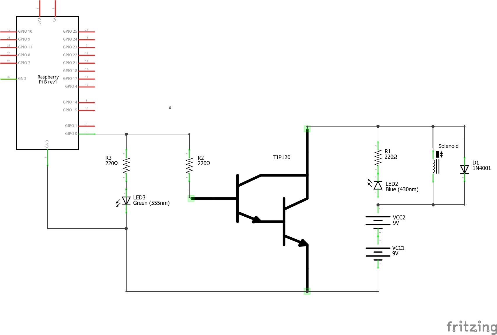

# PiStickHero

Python program to play Stick Hero using a Raspberry Pi.

Uses Raspberry Pi camera module to take photos of phone, and a simple Python program with OpenCV to do the image processing.
The Pi's GPIO is then used to control a circuit which switches on a solenoid for a duration proportional to the distance between the platforms.

See the video at https://www.youtube.com/watch?v=s_JnU4rzq9o.

